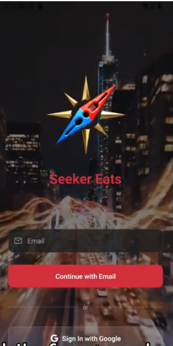
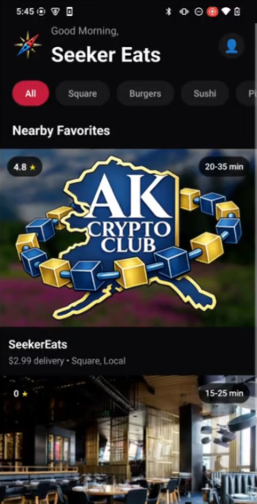
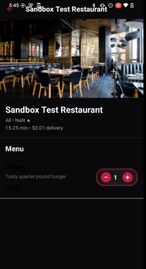
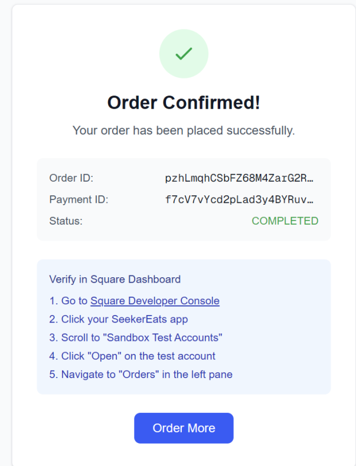
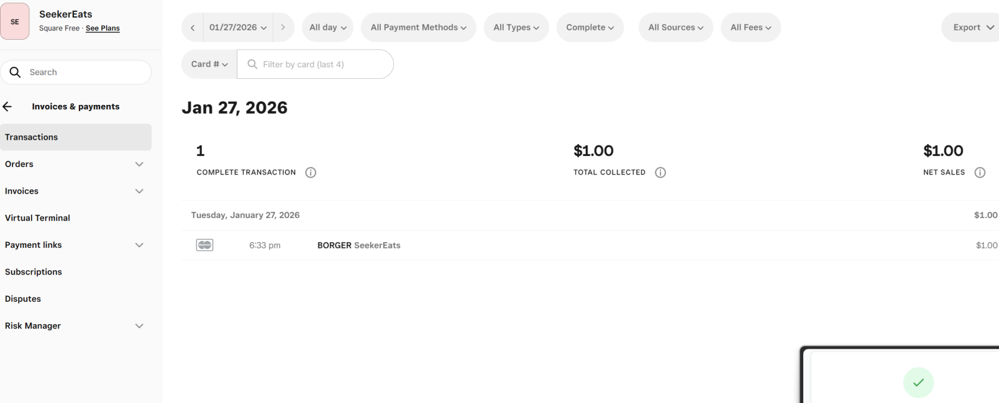
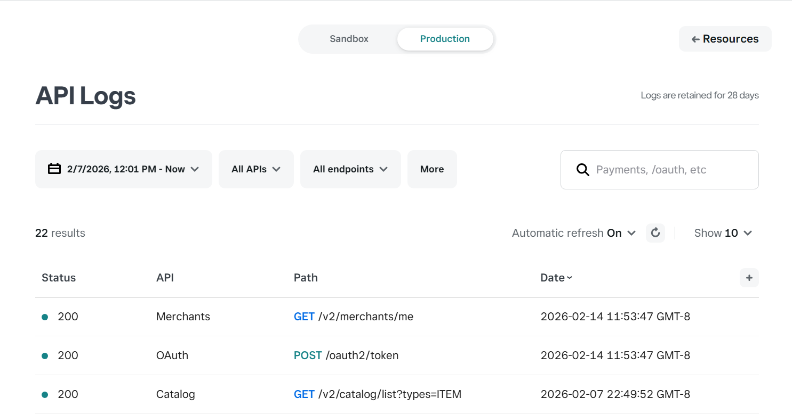

# Seeker Eats

**Crypto-native food delivery powered by Solana**

[](https://solana.com)
[](https://expo.dev)
[](https://typescriptlang.org)
[](https://reactnative.dev)

Seeker Eats is a food delivery app where customers pay with **USDC on Solana**. Restaurants receive orders through their existing **Square POS** system — no crypto knowledge required from restaurants or customers. The platform also integrates **DoorDash Drive** and **Twilio Voice** as fallback systems for delivery logistics and order confirmation when needed.

---

## Screenshots

<p align="center">
  
  
  
  
</p>

### Square POS Integration

<p align="center">
  
  
</p>

*Orders placed through Seeker Eats appear directly in the restaurant's Square dashboard. The Square API logs show real OAuth, Merchant, and Catalog API calls in production.*

---

## The Problem

Food delivery platforms charge restaurants 15-30% commission fees. Crypto payments could eliminate payment processing costs, but:
- Restaurants won't install new POS systems or learn crypto
- Customers don't want to manage wallets or seed phrases
- No existing solution connects crypto payments to real delivery infrastructure

## The Solution

Seeker Eats bridges the gap by integrating with systems restaurants already use:

- **Square** for menus, orders, and payments — restaurants change nothing about their workflow
- **Solana USDC** for customer payments — settled instantly, near-zero fees
- **Privy** for embedded wallets — users sign in with Google, wallet is created automatically
- **DoorDash Drive** *(fallback)* for delivery logistics when restaurants don't have their own drivers
- **Twilio Voice** *(fallback)* for automated order confirmation calls when Square notifications aren't sufficient

The restaurant never touches crypto. The customer never sees a seed phrase. The primary order flow goes entirely through Square — DoorDash and Twilio are pluggable fallback systems.

---

## How It Works

```
1. Sign In          Customer logs in with Google (Privy creates a Solana wallet)
        |
2. Browse           Menus pulled live from restaurant's Square catalog
        |
3. Order            Add items to cart, enter delivery address
        |
4. Pay              USDC transferred on Solana DevNet to merchant wallet
        |
5. Confirm          Order submitted to Square POS (restaurant sees it in their dashboard)
        |                \_ Fallback: Twilio calls the restaurant for confirmation
        |
6. Deliver          Restaurant handles delivery (or DoorDash Drive as fallback)
        |
7. Track            Real-time status updates in app
```

---

## Architecture

```
┌─────────────────────────────────────────────────────────┐
│                    Mobile App (Expo)                     │
│  React Native · Privy Auth · Solana Web3.js · NativeWind│
└──────────────────────┬──────────────────────────────────┘
                       │
                       │ HTTPS
                       ▼
┌─────────────────────────────────────────────────────────┐
│              Relay Backend (Node.js/Express)             │
│                   Hosted on Railway                      │
├─────────────┬──────────────┬──────────────┬─────────────┤
│   Square    │   Solana     │  DoorDash    │   Twilio    │
│   OAuth +   │   DevNet     │  Drive API   │  Voice API  │
│   Catalog   │   Validator  │  (fallback)  │  (fallback) │
│   Orders    │   On-chain   │  Quotes      │  Order calls│
│   Payments  │   tx verify  │  Tracking    │  DTMF input │
└─────────────┴──────────────┴──────────────┴─────────────┘
```

| Layer | Technology | Purpose |
|-------|-----------|---------|
| **Frontend** | React Native 0.81 + Expo 54 | Cross-platform mobile app |
| **Auth** | Privy (@privy-io/expo) | Google OAuth + embedded Solana wallets |
| **Payments** | @solana/web3.js + @solana/spl-token | USDC transfers on DevNet |
| **Backend** | Express.js on Railway | API relay and orchestration |
| **Menus** | Square SDK (OAuth) | Live restaurant catalog sync |
| **Delivery** | DoorDash Drive API | Fallback delivery quotes, dispatch, tracking |
| **Voice** | Twilio Voice API | Fallback automated order confirmation calls |
| **Database** | PostgreSQL (Prisma) | Merchants, orders, users |
| **Styling** | NativeWind (Tailwind CSS) | Responsive mobile UI |

---

## Key Features

### Embedded Wallets (No Seed Phrases)
Users sign in with Google. Privy creates and manages a Solana wallet behind the scenes. No extensions, no mnemonics, no private key management.

### USDC Payments on Solana
Checkout creates a real SPL token transfer on Solana DevNet. The app validates wallet balance, constructs the transaction, signs via Privy's embedded signer, and confirms on-chain — all in seconds.

### Square POS Integration
Restaurants connect via OAuth. Their Square catalog (menu items, prices, categories, images) syncs automatically. Orders flow back into Square. Restaurants manage everything from their existing dashboard.

### DoorDash Drive Delivery (Fallback)
For restaurants without their own delivery drivers, DoorDash Drive provides real delivery quotes with estimated pickup/dropoff times, driver dispatch, and live status tracking.

### Twilio Voice Order Confirmation (Fallback)
When Square POS notifications aren't sufficient, the backend can call the restaurant's phone number with a TwiML-generated message reading the order details. The restaurant presses:
- **1** — Accept (driver dispatched)
- **2** — Reject (customer notified)
- **3** — Repeat the order

### Demo Mode
For testing: all prices set to $0.01 USDC. Real Solana transactions still execute on DevNet, but you only need a tiny amount of test USDC. Togglable in Settings.

---

## Try It

### Download the APK

> **[Download seeker-eats.apk](https://github.com/obamna1/seekereats-relay/releases/latest)**
>
> Install on any Android device (enable "Install from unknown sources").

### Quick Start for Judges

1. **Install the APK** on an Android device or emulator
2. **Sign in with Google** — a Solana wallet is created automatically
3. **Get test funds** (Account tab → your wallet address):
   - [Solana Faucet](https://faucet.solana.com/) — get DevNet SOL (for transaction fees)
   - [SPL Token Faucet](https://spl-token-faucet.com/) — get DevNet USDC (for payments)
4. **Browse restaurants** and add items to your cart
5. **Checkout** — pay with USDC, watch the Solana transaction confirm
6. **Track delivery** — see real-time status updates

> Demo mode is enabled by default — all prices are $0.01 USDC.

---

## Project Structure

```
seeker-eats/
├── src/                            # Backend (Node.js Express)
│   ├── routes/                    # API endpoints
│   │   ├── restaurants.ts         # Menu listing (Square)
│   │   ├── relay.ts               # DoorDash delivery + Twilio calls
│   │   ├── square.ts              # Square menu, quotes, orders
│   │   ├── oauth.ts               # Square OAuth flow
│   │   └── twilio.ts              # Voice call webhooks
│   ├── clients/                   # External API clients
│   │   ├── DoorDashClient.ts      # DoorDash Drive wrapper
│   │   └── SquareClient.ts        # Square API client
│   ├── lib/                       # Business logic
│   │   ├── solana-validator.ts    # On-chain payment verification
│   │   └── square-oauth.ts        # OAuth token management
│   └── index.ts                   # Server entry point
│
├── ui/android/                     # Frontend (Expo/React Native)
│   ├── app/                       # Screens (file-based routing)
│   │   ├── sign-in.tsx            # Google OAuth login
│   │   ├── (tabs)/index.tsx       # Restaurant listing
│   │   ├── restaurant/[id].tsx    # Menu & ordering
│   │   ├── (tabs)/cart.tsx        # Cart & checkout
│   │   └── order-status.tsx       # Delivery tracking
│   ├── components/
│   │   ├── solana/                # Wallet integration (12 files)
│   │   ├── account/               # Balance, send, receive
│   │   └── auth/                  # Auth provider
│   ├── services/
│   │   ├── api.ts                 # Backend REST client
│   │   └── solana-payment.service.ts  # USDC transfer logic
│   └── store/
│       └── cart-store.tsx         # Cart state (React Context)
│
├── prisma/schema.prisma            # Database schema
└── screenshots/                    # App screenshots
```

---

## API Endpoints

### Public
| Method | Endpoint | Description |
|--------|----------|-------------|
| GET | `/restaurants` | List restaurants (Square catalog) |
| GET | `/restaurants/:id` | Restaurant details + menu |
| GET | `/health` | Health check |

### Protected (X-Relay-Secret)
| Method | Endpoint | Description |
|--------|----------|-------------|
| POST | `/relay/delivery` | Get DoorDash delivery quote |
| POST | `/relay/delivery/:id/accept` | Accept quote, dispatch driver |
| GET | `/relay/delivery/:id` | Delivery status |
| POST | `/relay/order-call` | Initiate Twilio call to restaurant |
| GET | `/relay/order-call/:sid/status` | Call response (accepted/rejected) |
| GET | `/square/menu` | Restaurant menu from Square |
| POST | `/square/orders/quote` | Order price quote |
| POST | `/square/orders/submit` | Submit order to Square |

### Square OAuth
| Method | Endpoint | Description |
|--------|----------|-------------|
| GET | `/oauth/start` | Begin OAuth flow |
| GET | `/oauth/callback` | Handle OAuth redirect |
| GET | `/merchants` | List connected merchants |

---

## Development Setup

### Prerequisites
- Node.js 18+
- Android Studio + Android SDK
- An Expo account (for EAS builds)

### Backend
```bash
# Install dependencies
npm install

# Configure environment
cp .env.example .env
# Fill in: DATABASE_URL, DOORDASH_*, TWILIO_*, SQUARE_*, X_RELAY_SECRET

# Run database migrations
npx prisma migrate deploy

# Start the server
npm run dev
```

### Mobile App
```bash
cd ui/android

# Install dependencies
npm install

# Configure environment
cp .env.example .env
# Fill in: EXPO_PUBLIC_SOLANA_RPC_URL, EXPO_PUBLIC_MERCHANT_WALLET_ADDRESS, etc.

# Run on Android emulator
npx expo run:android
```

### Build APK
```bash
cd ui/android
npx eas build -p android --profile dapp-store
```

---

## Solana Integration Details

| Component | Value |
|-----------|-------|
| **Network** | Solana DevNet |
| **Token** | USDC (Mint: `4zMMC9srt5Ri5X14GAgXhaHii3GnPAEERYPJgZJDncDU`) |
| **Merchant Wallet** | `CaQAKBcwf7G5vXeu2RNuNGJafnJ8724Uj4wv9ivfxfQA` |
| **Wallet Provider** | Privy Embedded Wallets |
| **Transaction Flow** | SPL Token Transfer (USDC) → On-chain confirmation → Backend verification |

The payment service (`solana-payment.service.ts`) handles:
1. Balance validation before checkout
2. Associated Token Account creation (if needed)
3. USDC transfer instruction construction
4. Transaction signing via Privy's embedded signer
5. On-chain confirmation with retry logic

---

## Demo Mode

Demo mode sets all prices to **$0.01 USDC** so judges can test the full flow with minimal funding:

- All menu item prices → $0.01
- Delivery fees → $0.01
- Real Solana transactions still execute on DevNet
- Toggle on/off in the Settings tab

To get test funds:
1. Copy your wallet address from the Account tab
2. Visit [faucet.solana.com](https://faucet.solana.com/) for DevNet SOL
3. Visit [spl-token-faucet.com](https://spl-token-faucet.com/) for DevNet USDC

---

## Built With

- [Solana](https://solana.com) — Blockchain payments
- [Privy](https://privy.io) — Embedded wallet infrastructure
- [Expo](https://expo.dev) — React Native framework
- [Square](https://squareup.com) — Restaurant POS integration
- [DoorDash Drive](https://www.doordash.com/engineering/drive/) — Fallback delivery logistics
- [Twilio](https://twilio.com) — Fallback voice order confirmation
- [Railway](https://railway.app) — Backend hosting
- [Prisma](https://prisma.io) — Database ORM
